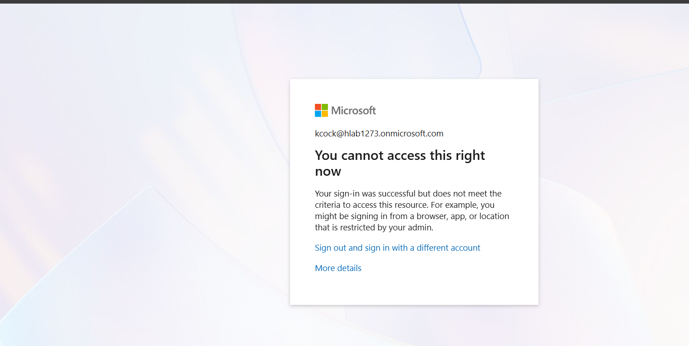
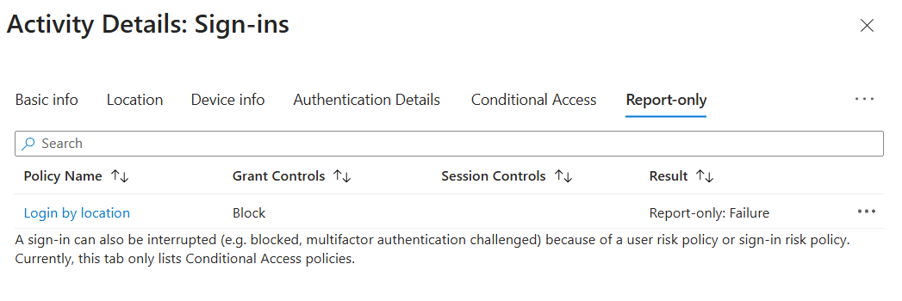

# Microsoft Entra Conditional Access: Block Sign-In by Location

Hands-on lab: building, testing, and debugging a real Conditional Access policy

# Purpose

Microsoft Entra Conditional Access is Microsoft's implementation of a zero-trust policy engine: it grants or blocks access to a resource based on signals (user, device, location, app, risk level) rather than a single static permission check. At its core, a Conditional Access policy is an if-then statement — e.g., "if a user signs in to this app from outside this network, then block access."

This lab builds and tests one concrete policy — block sign-in to the Azure Portal unless the request comes from a trusted/named IP location — end to end, including the two real misconfigurations hit along the way and how each was diagnosed.

# Environment

| Tenant | Personal Microsoft Entra training tenant (hlab1273.onmicrosoft.com) |
|---|---|
| Reference | Microsoft Learn — Plan and implement Conditional Access, and Block access by location |
| Test group | "Finance" — a group created for this exercise with two test users assigned |
| Break-glass accounts | Global Administrators excluded from the policy, per Microsoft's recommended practice |

# Attempt 1: First Pass

Followed one of Microsoft's documented example policies: block sign-in unless the request originates from a trusted IP range.

- Created a named Location in Entra and configured an IP range for it

- Created the Conditional Access policy referencing that named Location

- Created two test users and a group ("Finance"); scoped the policy to that group

- Excluded Global Administrator accounts from the policy (break-glass — this prevents a misconfigured policy from locking out the only accounts that can fix it)

- Deliberately set the trusted range to 10.0.0.0/24 — a range that should NOT match my actual network — to confirm the block would trigger

Result: sign-in was blocked for the test users as expected, confirming the policy mechanically worked.

## Open Questions From Attempt 1

- Is there a significant delay between disabling/deleting a Conditional Access policy and the change actually taking effect?

- Why didn't the sign-in logs show the failed sign-ins as failures? The user authenticated correctly (password + MFA) before Conditional Access evaluated and blocked the session — worth understanding whether that counts as a "successful authentication, blocked at authorization" rather than a logged failure.

## Design Gap Identified

On review, this policy didn't actually implement the intended goal. The intent was "block sign-in to the Azure Portal entirely unless coming from a trusted IP range." What got built instead was close, but not scoped correctly to that intent — a good reminder to re-read the policy's actual target resource/condition combination against the original goal before calling it done, not just confirm that *a* block occurred.

# Attempt 2: Corrected Policy (Block by Location)

Rebuilt the exercise following Microsoft's "Block access by location" documentation specifically, and hit two real configuration issues before it worked correctly.

## Issue 1: Policy Left in Report-Only Mode

Microsoft recommends creating a new Conditional Access policy in Report-only mode first — this lets you audit the sign-in logs to confirm a policy would have blocked the right sign-ins, without actually enforcing it yet. Report-only mode still allows the sign-in to succeed; it only logs what it would have done. This is the correct default for testing, but it means the policy won't visibly block anything until it's switched to On.

## Issue 2: Named Location Used an Internal, Not Public, IP Range

The named Location was initially set to an internal/private range (10.0.0.0/24). Conditional Access evaluates the sign-in request's public-facing source IP, so an internal RFC 1918 range can never match — Entra has no visibility into a private LAN range. Found the actual public IP via an external IP lookup service and set the named Location to the corresponding public CIDR range instead.

> Note: A home network's public IP can change (dynamic IP from most residential ISPs). A /16 range was used here for lab purposes to tolerate minor reassignment, but in a real deployment a named Location should reflect the actual, intentionally-scoped range an organization controls — not be widened just to avoid re-configuring it.

## Test and Result

With the named Location corrected to a public IP range and the policy set to On, signed in from an incognito browser window (to avoid cached tokens) and confirmed the block fired correctly:

*Microsoft sign-in block screen: "Your sign-in was successful but does not meet the criteria to access this resource."*

## Sign-In Log Detail

| Status | Failure |
|---|---|
| Sign-in error code | 53003 |
| Failure reason | Access has been blocked by Conditional Access policies. The access policy does not allow token issuance. |
| Authentication requirement | Single-factor authentication |
| App | Azure Portal |
| Source IP | <redacted — home public IP> |
| Device platform / state | Windows 10 / Unregistered |

This time the sign-in log correctly reflected a Failure with error 53003, unlike the first attempt — confirming the earlier open question: a sign-in that passes authentication but is blocked by Conditional Access is logged as a Failure once the policy is actually enforcing (not Report-only), with the specific error code identifying Conditional Access as the cause rather than a bad password or MFA rejection.

## Confirming via Report-Only

Switched the policy back to Report-only afterward to view how the same block appears on the Report-only tab of the sign-in log, for comparison:

*Sign-in activity detail, Report-only tab: policy "Login by location" would have returned Block (Report-only: Failure).*

# Lessons Learned

| Issue | Cause / Resolution |
|---|---|
| Policy didn't match the original intent (block ALL Azure Portal sign-ins outside a trusted range) | Re-read the policy's target resource and condition scope against the stated goal before considering it complete — a policy can technically block something and still not be the thing you meant to build. |
| Policy appeared to have no effect at first | It was still in Report-only mode, which audits but never enforces. Report-only is the correct starting point, but it has to be explicitly switched to On to actually block sign-ins. |
| Named Location IP range never matched | The range was set to an internal/private (RFC 1918) address. Conditional Access only sees the public-facing source IP, so the named Location must be a public CIDR range, not an internal one. |
| Failed sign-ins didn't initially show as failures in the log | This only looked like a false negative because the first attempt's policy wasn't actually blocking anything correctly yet. Once enforcement was working (Attempt 2), the log correctly showed Status: Failure with error code 53003. |

# Best Practices Confirmed

- Always exclude at least one break-glass/emergency-access account (typically Global Administrators) from any Conditional Access policy that could plausibly block sign-in — an incorrectly scoped policy can otherwise lock an admin out of their own tenant with no way back in.

- Deploy new policies in Report-only mode first and review the Report-only sign-in log tab before switching enforcement on.

- Scope location-based policies to test/pilot groups before rolling out tenant-wide.

- Test from an incognito/private browser window to avoid an already-cached token masking the policy's effect.

# Overall Takeaway

Good practical exposure to the gap between "a policy that technically does something" and "a policy that does the thing you actually intended" — plus a concrete, first-hand look at why Report-only mode and break-glass accounts exist as standard practice rather than optional caution. Conditional Access is powerful enough that a misconfigured policy has real consequences (a tenant-wide lockout), which argues for exactly this kind of deliberate, test-group-first practice before ever touching a production tenant.
