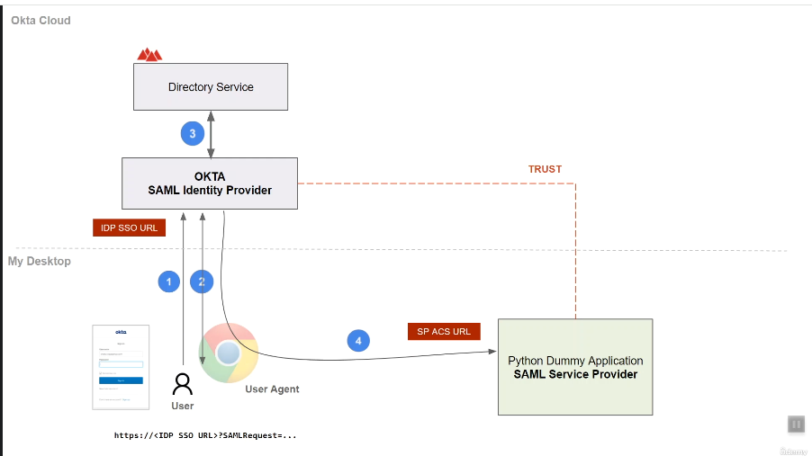
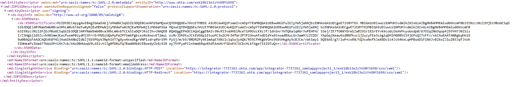
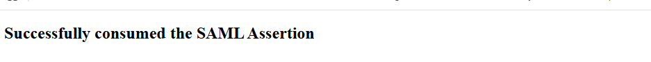

# SAML SSO Testing with a Python Dummy Service Provider

Okta (IdP) → Local Python "Dummy App" (SP) — Lab Walkthrough & Notes

# Purpose

This lab stands up a minimal, do-nothing Service Provider (SP) — a local Python script — purely to receive and inspect a SAML assertion issued by Okta (the Identity Provider / IdP). The goal isn't a working application; it's to see every piece of a SAML SSO exchange up close: the AuthnRequest, the ACS URL, the IdP metadata, the signed assertion, and how to validate it independently of any real app's error handling.

# Key Terms

| Term | Definition |
|---|---|
| SAML Assertion / Token | The signed XML payload the IdP sends to the SP after a successful sign-in, asserting the user's identity and attributes. |
| Assertion Consumer Service (ACS) URL | The SP endpoint the IdP sends the assertion/SAML response to. In this lab: http://localhost:8080/cgi-bin/saml-consumer.py |
| Audience URI (SP Entity ID) | A unique identifier for the application (SP). On receipt, the SP should validate this to confirm the assertion was actually meant for it. |
| Default Relay State | Where the user should land after a successful sign-in. Only relevant for IdP-initiated SSO. |
| NameID Format | How the app identifies the user (e.g., email address, unspecified). |
| X.509 Certificate (IdP metadata) | The IdP's public key certificate. The SP uses it to verify the signature on the SAML response/assertion. |

# Architecture



*SAML SSO flow: user → Okta IdP → directory lookup → signed assertion POSTed to the SP's ACS URL.*

# Prerequisites

- Python 3 installed and on PATH (verify with: python --version)

- Course .zip extracted locally, containing the saml-dummy-app and saml-templates folders under a saml-course directory

- The Dummy SP's Python scripts live in saml-dummy-app\cgi-bin (saml-consumer.py, saml-logout.py)

- An Okta developer/free-tier tenant with a SAML app configured, pointing at the local ACS URL

# Step-by-Step Setup

## 1. Start the local HTTP server (acting as the SP)

Run from inside the saml-dummy-app directory:

```
# Windows
cd "<SAML-COURSE-PATH>\saml-dummy-app"
python -m http.server --cgi 8080
# macOS / Linux
cd <SAML-COURSE-PATH>/saml-dummy-app
python3 -m http.server --cgi 8080
```

> Note: Windows will prompt to allow the server through the firewall — allow it on Public networks (or whichever profile matches your network) so it can bind and accept local connections.

## 2. Confirm the SP endpoint is reachable

The course's suggested curl command does not work as-is in PowerShell. Use Invoke-WebRequest instead:

```
# Windows (PowerShell)
$(Invoke-WebRequest http://localhost:8080/cgi-bin/saml-consumer.py -Method Post).RawContent
# macOS / Linux
curl -X POST http://localhost:8080/cgi-bin/saml-consumer.py
```

Expected response:

```
HTTP/1.0 200 OK
Server: SimpleHTTP/0.6  Python/3.14.6
Content-Type: text/html
 
<h2>Successfully consumed the SAML Assertion</h2>
```

## 3. Configure the SAML app in Okta

Set the following fields on the Okta SAML app integration to match the local Dummy SP:

- ACS URL: http://localhost:8080/cgi-bin/saml-consumer.py

- Audience URI (SP Entity ID): a unique string identifying this app — the SP should validate this field against any assertion it receives

- Default Relay State: leave blank for SP-initiated testing; only used for IdP-initiated SSO

- NameID Format: choose how the user should be identified (e.g., EmailAddress)

## 4. Retrieve the IdP metadata

Okta's IdP metadata includes the X.509 signing certificate, the NameID format options, and the SSO service bindings/URLs (HTTP-POST and HTTP-Redirect). The SP uses the certificate to verify the signature on any assertion it receives.



*IdP metadata excerpt: KeyDescriptor/X509Certificate, NameID formats, and SingleSignOnService bindings.*

## 5. Manually craft and test a SAML AuthnRequest

Using the SAML Developer Tools site (samltool.com/url.php), build and encode a SAML AuthnRequest manually to drive the flow without relying on the IdP's own "Preview" button:

```
<?xml version="1.0" encoding="UTF-8"?>
<saml2p:AuthnRequest
  xmlns:saml2p="urn:oasis:names:tc:SAML:2.0:protocol"
  AssertionConsumerServiceURL="http://localhost:8080/cgi-bin/saml-consumer.py"
  Destination="<Okta SSO URL>"
  ID="Saml-verification"
  IssueInstant="<UTC timestamp>"
  ProtocolBinding="urn:oasis:names:tc:SAML:2.0:bindings:HTTP-POST"
  Version="2.0">
  <saml2:Issuer xmlns:saml2="urn:oasis:names:tc:SAML:2.0:assertion">
    http://localhost:8080/saml-app-project-1
  </saml2:Issuer>
</saml2p:AuthnRequest>
```

Encoding order: deflate (compress) the XML → base64-encode the deflated bytes → URL-encode the base64 string for use as the SAMLRequest query parameter. Append it to the IdP SSO URL:

```
<Okta SSO URL>?SAMLRequest=<url-encoded-deflated-base64-xml>
```

> Gotcha: The IssueInstant timestamp matters. A request with a timestamp Okta considers invalid/expired (e.g., malformed or too far off) returns an HTTP 400 before you even reach the sign-in page. Setting it to a recent-but-safely-past UTC timestamp resolved this.

## 6. Validate the result

After signing in, the browser lands on the Dummy SP and the Python server logs a successful POST:



*Dummy SP response after a successful SAML POST.*

```
::1 - - [date] "POST /cgi-bin/saml-consumer.py HTTP/1.1" 200 -
::1 - - [date] CGI script exited OK
```

To validate the SAML Response independently, use the Validate option on samltool.com:

- Copy the raw SAML Response value out of the browser's developer tools (Network tab, the POST body)

- Paste it into the SAML Response field

- Populate IdP Entity ID, SP Entity ID, and the SP's Attribute Consume Service Endpoint / Destination URL to match your app's values

- Check "Ignore timing issues" when testing with a manually-crafted request (the timestamps won't line up with real-time validation otherwise)

- Click Validate to confirm the response and signature are well-formed

# Troubleshooting & Lessons Learned

| Issue | Cause / Resolution |
|---|---|
| curl command from the course didn't run in PowerShell | PowerShell's curl is an alias for Invoke-WebRequest with different syntax. Used $(Invoke-WebRequest <url> -Method Post).RawContent instead. |
| 400 Bad Request when submitting the manually-encoded SAMLRequest URL | The IssueInstant field was not acceptable to Okta. Setting it to a valid recent UTC timestamp before encoding resolved it. |
| Okta MFA kept looping / blocking sign-in during app testing | Resolved by (1) creating a second test user assigned to the app and (2) temporarily disabling MFA so password-only sign-in could complete. Okta's authentication policies determine when/whether MFA is required per app vs. per admin console sign-in, and are worth a deeper read — this needs more study. |
| MFA prompt appears for the Okta admin dashboard but not for the test app's sign-in | Different authentication policies evidently apply to admin console access vs. this specific app's sign-in flow. Not yet fully understood — flagged as an open question below. |

# Open Questions / Next Steps

- Dig into Okta Authentication Policies and Authenticator enrollment policies to understand why MFA behaves differently for admin console sign-in vs. app sign-in.

- Find a community resource (Okta Developer Forum, Discord, etc.) for common gotchas other learners have hit with this same lab — several of the issues above felt like well-trodden ground.

- Repeat the exercise with MFA enabled end-to-end once the authentication-policy behavior is better understood, rather than disabling it to get a clean test run.

# Overall Takeaway

Good hands-on practice for seeing the full SAML exchange — AuthnRequest construction/encoding, IdP metadata and signing certificates, the ACS URL contract, and independent response validation — outside of a polished app that would otherwise hide these mechanics behind its own error handling.
